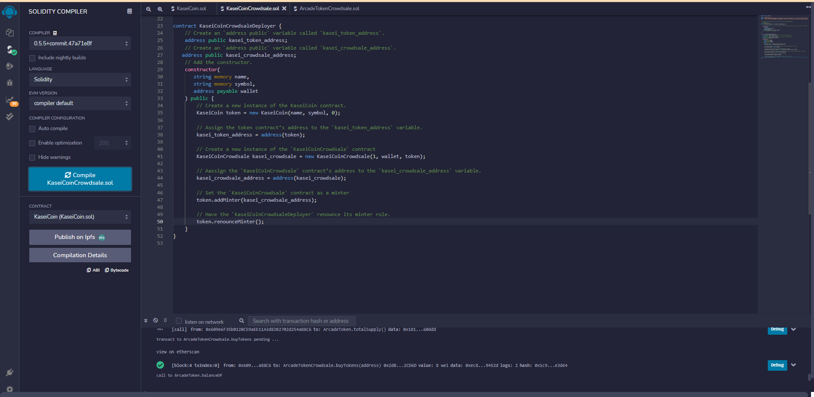

# Application

## Martian Token Crowdsale

A fungible token that is ERC-20 compliant and that will be minted by using a `Crowdsale` contract from the OpenZeppelin Solidity library is created.

The crowdsale contract that is created will manage the entire crowdsale process, allowing users to send ether to the contract and in return receive KAI, or KaseiCoin tokens. The contract mints the tokens automatically and distribute them to buyers in one transaction.


## Evaluation Evidence





## Technologies

This project uses the following packages:

* [Remix](https://remix.ethereum.org/) - Remix is a browser-based compiler and IDE that enables users to build Ethereum contracts with Solidity language and to debug transactions.

* [Solidity](https://docs.soliditylang.org/) - Solidity is an object-oriented, high-level language for implementing smart contracts. Smart contracts are programs which govern the behaviour of accounts within the Ethereum state.

---

## Installation Guide

This project can be run online. There is no need to install any packages locally.

---

## Usage

Please download the project or clone the project using git clone

Please launch remix by typing the following on the browser:

```python
https://remix.ethereum.org/
```

---

## Contributors

Abhishika Fatehpuria (abhishika@gmail.com)
---

## License

MIT
​
